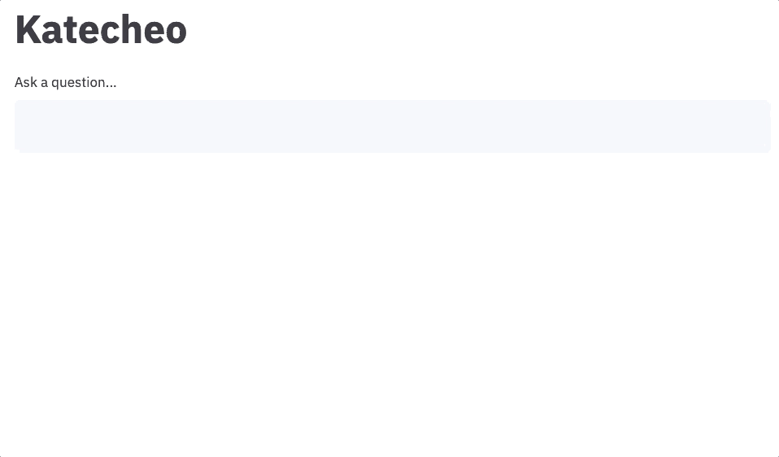

Katecheo is a modular system for topical question answering built on Kubernetes. It is portable to any Kubernetes cluster (in the cloud or on-prem), and it allows developers to integrate state-of-the-art questions answering into their applications via its REST API.  

Check out [this screencast](https://youtu.be/dyhkLuq4Lo8) to see Katecheo in action!

## Deploy Katecheo

### System Prerequisites

Katecheo runs on Kubernetes to serve predictions. Our tests were done on the OpenShift platform. To run Katecheo, you will need:

- A Kubernetes cluster (see [here](https://kubernetes.io/docs/home/) for more information)

### Data/model Preparation

To match topical questions with appropriate knowledge base articles, Katecheo relies on one or more sets of knowledge base articles (one per topic of interest, e.g., one for sports or one for health). For each topic you want to enable in Katecheo, you will need a JSON file containing Knowledge base articles (structure as shown [here](https://storage.googleapis.com/pachyderm-neuralbot/knowledge_bases/kb_medical_small.json))

### Deploy

1. Clone this repo.

2. Ensure that `kubectl` connects to your cluster

3. Apply configuration information to the cluster

    ```
    $ kubectl apply -f ./deploy/katecheo-config-map.yaml
    ```

4. Create the resources for the deployment

    ```
    $ kubectl apply -f ./deploy/katecheo-deployment.yaml
    ```

5. Allow access to the deployment

    ```
    $ kubectl apply -f ./deploy/katecheo-svc.yaml
    ```
## Usage

### Via REST API 

Example request (Question):

```
$ curl -X POST -H 'Content-Type: application/json' -d '{"params": "Can acupuncture help me loose weight?"}' https://katecheo-route-katecheo.apps.ice-staging.cfdf.p2.openshiftapps.com/questiondetector
```

Example response (Answer):

```
{
  "meta": {
    "tags": {
      "article_id": "http://answers.webmd.com/answers/5074670/does-acupuncture-aid-weight-loss",
      "comprehension_error": "",
      "comprehension_model": "BERT",
      "kb_search_error": "",
      "on_topic": true,
      "question": true,
      "question_detector_error": "",
      "topic": "health"
    }
  },
  "strData": "acupuncture works by targeting pressure points linked to appetite and hunger"
}
```

### Example Streamlit app



We've also created an example [Streamlit app](https://www.streamlit.io/) to demonstrate Katecheo. Details on running the application are included [here](demo).

## Future extensions

In the future we intend to:

- Extend our knowledge base search methodology (e.g., to use bigrams and/or more sophisticated language models)
- Enable usage of a wider variety of pre-trained models (BERT, XLNet, etc.)
- Allow users to dynamically switch similarity thresholds and/or comprehension models

## Citing

If you use Katecheo in your research, please cite [Katecheo: A Portable and Modular System for Multi-Topic Question
Answering](https://arxiv.org/abs/1907.00854):

```
@inproceedings{CV2019Katecheo,
  title={Katecheo: A Portable and Modular System for Multi-Topic Question Answering},
  author={Shirish Hirekodi and Seban Sunny and Leonard Topno and Alwin Daniel and Reuben Skewes and Stuart Cranney and Daniel Whitenack},
  year={2019},
  Eprint = {arXiv:1907.00854},
}
```

___
All material is licensed under the [Apache License Version 2.0, January 2004](http://www.apache.org/licenses/LICENSE-2.0).
